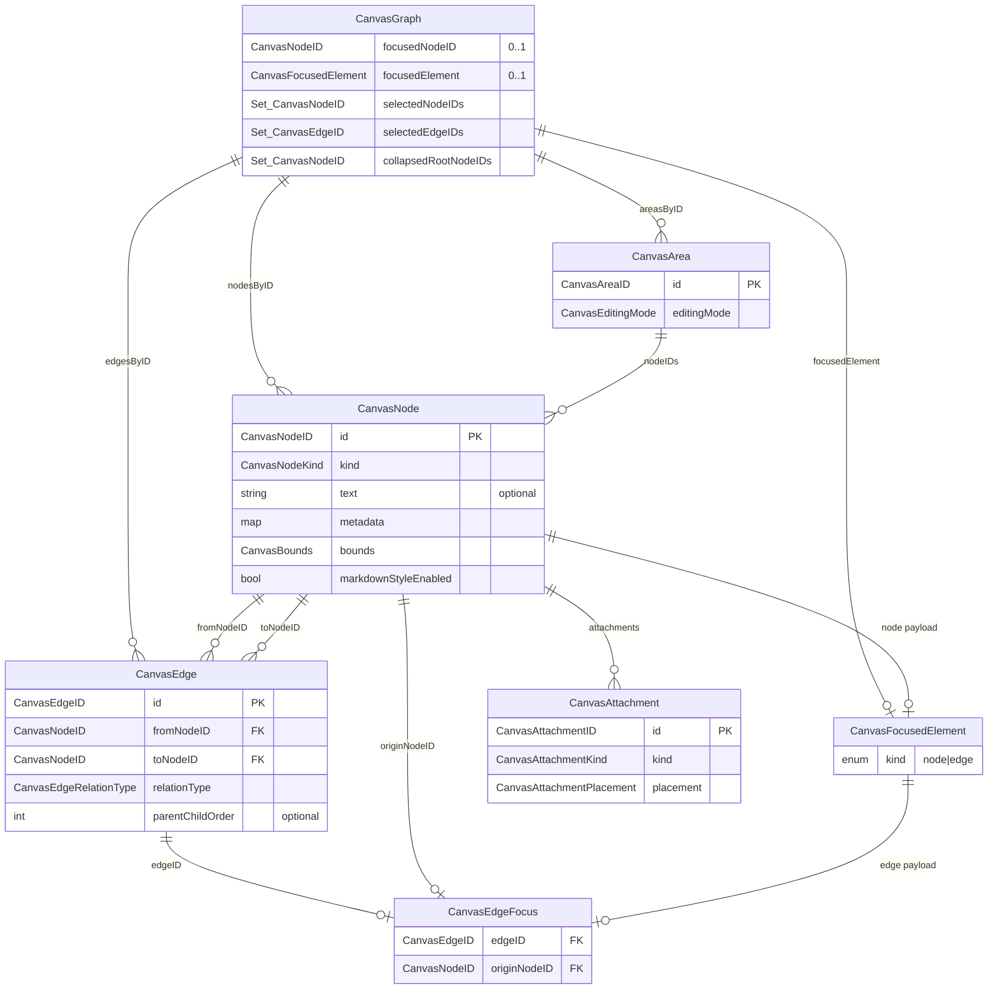
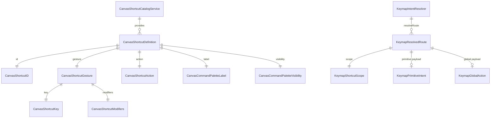

# HotkeyCanvas Domain ER図

## 1. 目的

- `Sources/Domain/` の主要モデル間の関係を、実装準拠で可視化する。
- `docs/specs/domain.md` の読解補助として、集約境界と多重度を明示する。
- 各ドメインの責務・不変条件・利用状況の本文は `docs/specs/domain.md` を正本として参照する。

## 2. スコープ

- 対象は Domain の主要エンティティ/値オブジェクトのうち、現時点で ER として可視化済みの領域（キャンバス編集コア、ショートカット解決）。
- サービス実装詳細（アルゴリズム）は対象外。

## 3. キャンバス編集コア ER

補足:

- `CanvasArea` と `CanvasNode` は実装上 `nodeIDs: Set<CanvasNodeID>` による参照。  
  ドメイン不変条件として「各 `CanvasNode` はちょうど1つの `CanvasArea` に所属」する。
- `CanvasEdge` は `fromNodeID` と `toNodeID` で `CanvasNode` を参照する有向辺。
- `collapsedRootNodeIDs` は「可視性計算の入力集合」で、ノード実体は `CanvasNode` 側に存在する。
- `focusedElement` は `node` または `edge` を保持し、`edge` の場合は `CanvasEdgeFocus`（`edgeID` と `originNodeID`）を保持する。
- `selectedEdgeIDs` は edge 対象時の複数選択集合で、正規化時に `focused edge` を必ず含む。
- `CanvasNode.metadata["createdOrder"]` は作成順メタデータとして利用し、area 跨ぎフォーカス移動時の Diagram アンカー決定に使用する。

## 4. ショートカット解決 ER

補足:

- `KeymapIntentResolver.resolveRoute(for:)` は現状 `primitive` / `global` を返し、非対応入力は `nil`。
- `modal` は `KeymapResolvedRoute` のスコープ語彙として存在するが、現実装では View 側状態管理で処理する。
