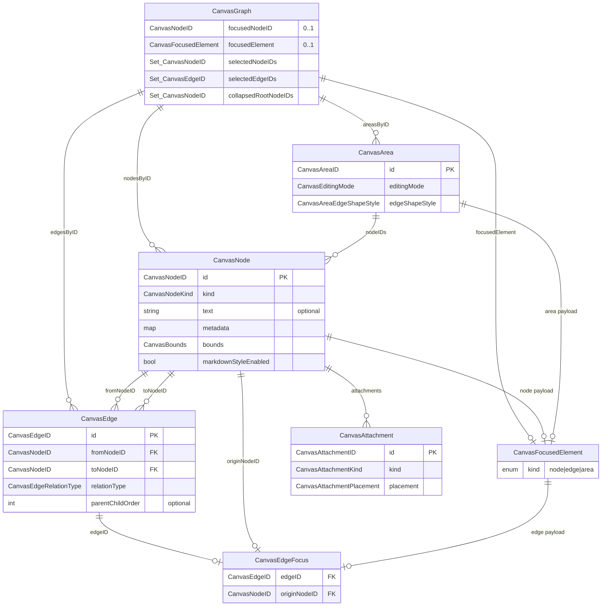
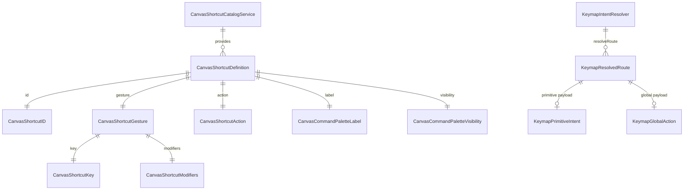

# HotkeyCanvas ドメイン ER 図

## 1. 目的

- `Sources/Domain/` の主要モデル間の関係を、実装準拠で可視化する。
- `docs/specs/domain.md` の読解補助として、集約境界と多重度を明示する。
- 各ドメインの責務・不変条件・利用状況の本文は `docs/specs/domain.md` を正本として参照する。

## 2. スコープ

- 対象は Domain の主要エンティティ/値オブジェクト、およびショートカット解決で中核となるサービス起点の型関係のうち、現時点で可視化済みの領域（キャンバス編集コア、ショートカット解決）。
- サービス実装詳細（アルゴリズム）は対象外。

## 3. キャンバス編集コア ER

```mermaid
erDiagram
    CanvasGraph ||--o{ CanvasNode : "nodesByID"
    CanvasGraph ||--o{ CanvasEdge : "edgesByID"
    CanvasGraph ||--o{ CanvasArea : "areasByID"
    CanvasGraph ||--o| CanvasFocusedElement : "focusedElement"

    CanvasNode ||--o{ CanvasAttachment : "attachments"

    CanvasNode ||--o{ CanvasEdge : "fromNodeID"
    CanvasNode ||--o{ CanvasEdge : "toNodeID"
    CanvasNode ||--o| CanvasFocusedElement : "node payload"
    CanvasEdge ||--o| CanvasEdgeFocus : "edgeID"
    CanvasNode ||--o| CanvasEdgeFocus : "originNodeID"
    CanvasFocusedElement ||--o| CanvasEdgeFocus : "edge payload"
    CanvasArea ||--o| CanvasFocusedElement : "area payload"

    CanvasArea ||--o{ CanvasNode : "nodeIDs"

    CanvasGraph {
        CanvasNodeID focusedNodeID "0..1"
        CanvasFocusedElement focusedElement "0..1"
        Set_CanvasNodeID selectedNodeIDs
        Set_CanvasEdgeID selectedEdgeIDs
        Set_CanvasNodeID collapsedRootNodeIDs
    }

    CanvasNode {
        CanvasNodeID id PK
        CanvasNodeKind kind
        string text "optional"
        map metadata
        CanvasBounds bounds
        bool markdownStyleEnabled
    }

    CanvasAttachment {
        CanvasAttachmentID id PK
        CanvasAttachmentKind kind
        CanvasAttachmentPlacement placement
    }

    CanvasEdge {
        CanvasEdgeID id PK
        CanvasNodeID fromNodeID FK
        CanvasNodeID toNodeID FK
        CanvasEdgeRelationType relationType
        int parentChildOrder "optional"
    }

    CanvasFocusedElement {
        enum kind "node|edge|area"
    }

    CanvasEdgeFocus {
        CanvasEdgeID edgeID FK
        CanvasNodeID originNodeID FK
    }

    CanvasArea {
        CanvasAreaID id PK
        CanvasEditingMode editingMode
        CanvasAreaEdgeShapeStyle edgeShapeStyle
    }
```

補足:

- `CanvasArea` と `CanvasNode` は実装上 `nodeIDs: Set<CanvasNodeID>` による参照。  
  ドメイン不変条件として「各 `CanvasNode` はちょうど1つの `CanvasArea` に所属」する。
- `CanvasEdge` は `fromNodeID` と `toNodeID` で `CanvasNode` を参照する有向辺。
- `focusedElement` は `node` / `edge` / `area` を保持し、`edge` の場合は `CanvasEdgeFocus`（`edgeID` と `originNodeID`）を保持する。
- `CanvasNode.metadata["createdOrder"]` は作成順メタデータを保持する。

## 4. ショートカット解決 ER

```mermaid
erDiagram
    CanvasShortcutCatalogService ||--o{ CanvasShortcutDefinition : "provides"
    CanvasShortcutDefinition ||--|| CanvasShortcutID : "id"
    CanvasShortcutDefinition ||--|| CanvasShortcutGesture : "gesture"
    CanvasShortcutDefinition ||--|| CanvasShortcutAction : "action"
    CanvasShortcutDefinition ||--|| CanvasCommandPaletteLabel : "label"
    CanvasShortcutDefinition ||--|| CanvasCommandPaletteVisibility : "visibility"

    CanvasShortcutGesture ||--|| CanvasShortcutKey : "key"
    CanvasShortcutGesture ||--|| CanvasShortcutModifiers : "modifiers"

    KeymapIntentResolver ||--o{ KeymapResolvedRoute : "resolveRoute"
    KeymapResolvedRoute ||--o| KeymapPrimitiveIntent : "primitive payload"
    KeymapResolvedRoute ||--o| KeymapGlobalAction : "global payload"
```

補足:

- `KeymapResolvedRoute` は `primitive` / `global` / `modal` の route 語彙を持つ。
