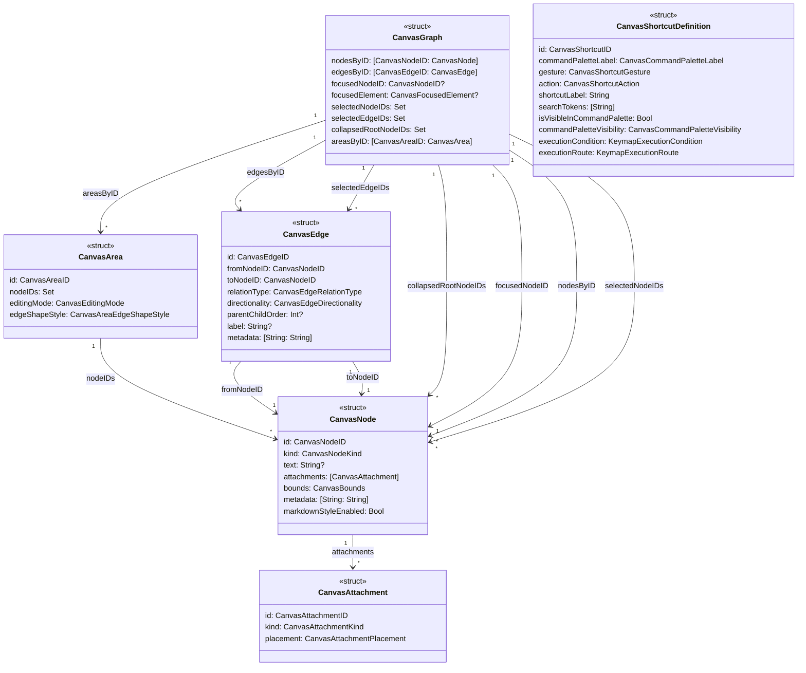

# HotkeyCanvas ドメインモデル関係図

この文書は `scripts/generate_domain_docs.sh` により自動生成されます。手動編集はしないでください。

- entity ノード数: 6
- entity 間参照数: 11

```mermaid
classDiagram
class CanvasArea {
  <<struct>>
  id: CanvasAreaID
  nodeIDs: Set<CanvasNodeID>
  editingMode: CanvasEditingMode
  edgeShapeStyle: CanvasAreaEdgeShapeStyle
}
class CanvasAttachment {
  <<struct>>
  id: CanvasAttachmentID
  kind: CanvasAttachmentKind
  placement: CanvasAttachmentPlacement
}
class CanvasEdge {
  <<struct>>
  id: CanvasEdgeID
  fromNodeID: CanvasNodeID
  toNodeID: CanvasNodeID
  relationType: CanvasEdgeRelationType
  directionality: CanvasEdgeDirectionality
  parentChildOrder: Int?
  label: String?
  metadata: [String: String]
}
class CanvasGraph {
  <<struct>>
  nodesByID: [CanvasNodeID: CanvasNode]
  edgesByID: [CanvasEdgeID: CanvasEdge]
  focusedNodeID: CanvasNodeID?
  focusedElement: CanvasFocusedElement?
  selectedNodeIDs: Set<CanvasNodeID>
  selectedEdgeIDs: Set<CanvasEdgeID>
  collapsedRootNodeIDs: Set<CanvasNodeID>
  areasByID: [CanvasAreaID: CanvasArea]
}
class CanvasNode {
  <<struct>>
  id: CanvasNodeID
  kind: CanvasNodeKind
  text: String?
  attachments: [CanvasAttachment]
  bounds: CanvasBounds
  metadata: [String: String]
  markdownStyleEnabled: Bool
}
class CanvasShortcutDefinition {
  <<struct>>
  id: CanvasShortcutID
  commandPaletteLabel: CanvasCommandPaletteLabel
  gesture: CanvasShortcutGesture
  action: CanvasShortcutAction
  shortcutLabel: String
  searchTokens: [String]
  isVisibleInCommandPalette: Bool
  commandPaletteVisibility: CanvasCommandPaletteVisibility
  executionCondition: KeymapExecutionCondition
  executionRoute: KeymapExecutionRoute
}
CanvasArea "1" --> "*" CanvasNode : nodeIDs
CanvasEdge "1" --> "1" CanvasNode : fromNodeID
CanvasEdge "1" --> "1" CanvasNode : toNodeID
CanvasGraph "1" --> "*" CanvasArea : areasByID
CanvasGraph "1" --> "*" CanvasEdge : edgesByID
CanvasGraph "1" --> "*" CanvasEdge : selectedEdgeIDs
CanvasGraph "1" --> "*" CanvasNode : collapsedRootNodeIDs
CanvasGraph "1" --> "1" CanvasNode : focusedNodeID
CanvasGraph "1" --> "*" CanvasNode : nodesByID
CanvasGraph "1" --> "*" CanvasNode : selectedNodeIDs
CanvasNode "1" --> "*" CanvasAttachment : attachments
```
