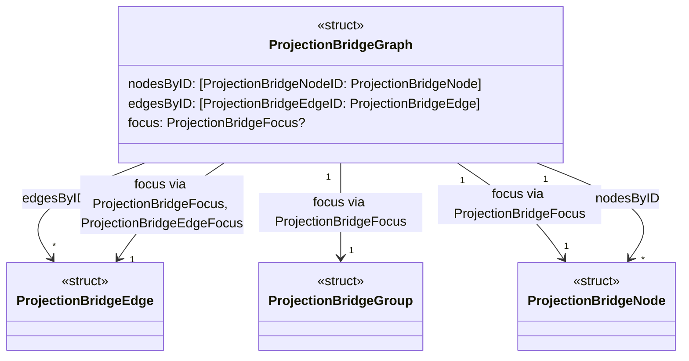

# Projection Bridge Domain Model Relations

この文書は `scripts/generate_domain_docs.sh` により自動生成されます。手動編集はしないでください。

- entity ノード数: 4
- entity 間参照数: 5

```mermaid
classDiagram
class ProjectionBridgeEdge {
  <<struct>>
}
class ProjectionBridgeGraph {
  <<struct>>
  nodesByID: [ProjectionBridgeNodeID: ProjectionBridgeNode]
  edgesByID: [ProjectionBridgeEdgeID: ProjectionBridgeEdge]
  focus: ProjectionBridgeFocus?
}
class ProjectionBridgeGroup {
  <<struct>>
}
class ProjectionBridgeNode {
  <<struct>>
}
ProjectionBridgeGraph "1" --> "*" ProjectionBridgeEdge : edgesByID
ProjectionBridgeGraph "1" --> "1" ProjectionBridgeEdge : focus via ProjectionBridgeFocus, ProjectionBridgeEdgeFocus
ProjectionBridgeGraph "1" --> "1" ProjectionBridgeGroup : focus via ProjectionBridgeFocus
ProjectionBridgeGraph "1" --> "1" ProjectionBridgeNode : focus via ProjectionBridgeFocus
ProjectionBridgeGraph "1" --> "*" ProjectionBridgeNode : nodesByID
```
