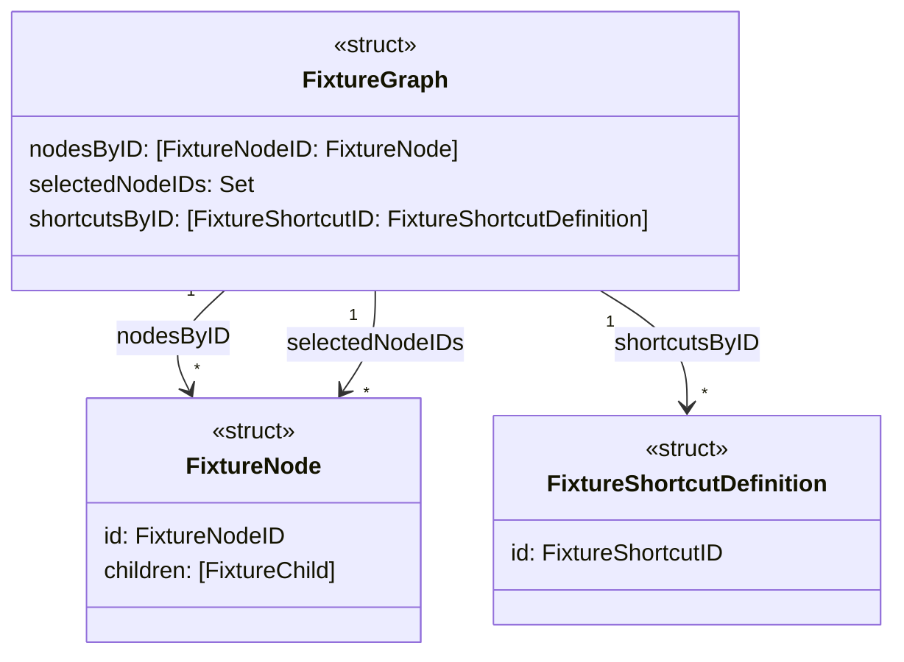

# Fixture Domain Model Relations

この文書は `scripts/generate_domain_docs.sh` により自動生成されます。手動編集はしないでください。

- entity ノード数: 3
- entity 間参照数: 3

```mermaid
classDiagram
class FixtureGraph {
  <<struct>>
  nodesByID: [FixtureNodeID: FixtureNode]
  selectedNodeIDs: Set<FixtureNodeID>
  shortcutsByID: [FixtureShortcutID: FixtureShortcutDefinition]
}
class FixtureNode {
  <<struct>>
  id: FixtureNodeID
  children: [FixtureChild]
}
class FixtureShortcutDefinition {
  <<struct>>
  id: FixtureShortcutID
}
FixtureGraph "1" --> "*" FixtureNode : nodesByID
FixtureGraph "1" --> "*" FixtureNode : selectedNodeIDs
FixtureGraph "1" --> "*" FixtureShortcutDefinition : shortcutsByID
```
